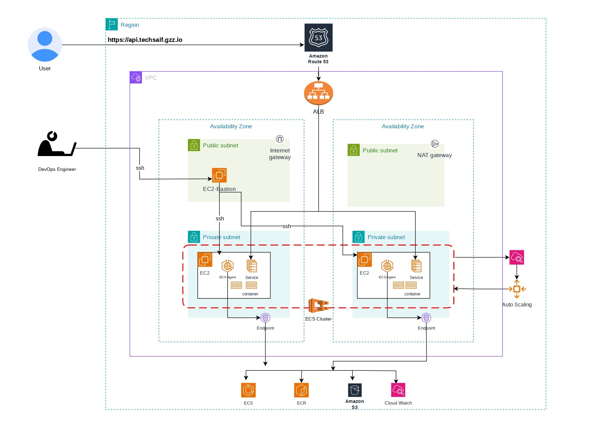
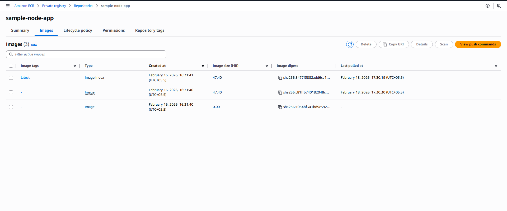

# ECS_Cluster_on_EC2_with_Terraform

This project provisions a complete AWS infrastructure using Terraform to deploy a Node.js containerized application on Amazon ECS (EC2 launch type) behind an Application Load Balancer, with a custom domain and HTTPS enabled.
It follows Infrastructure as Code (IaC) best practices using modular Terraform design.

### Architecture Diagram

<p align="center">
  
</p>

### This setup provisions:

- ➡️ VPC (public & Private subnet, Nat gateway, EIP, Internet Gateway, and route tables)
- ➡️ Security Groups
- ➡️ VPC Endpoints
- ➡️ Bastion Host (EC2 in Public Subnet)
- ➡️ IAM Roles (ECS Instance Role, ECS Task Execution Role)
- ➡️ Auto Scaling Group (ECS Cluster Capacity)
- ➡️ ECS Cluster (EC2 launch type)
- ➡️ Application Load Balancer 
- ➡️ ACM SSL Certificate
- ➡️ Route 53 Hosted Zone & DNS Record

## Prerequisites
Before Running Terraform, Make sure you have the following prerequisites ready:

- ➡️ Terraform v1.3+ (recommended)
- ➡️ AWS CLI configured with proper IAM credentials
- ➡️ A registered domain name (e.g., from GoDaddy, Namecheap, etc.)
- ➡️ Hosted Zone created in Route 53 — Example: hosted zone name: api.techsaif.gzz.io
- ➡️ Name Servers updated at your domain registrar
- ➡️ Public and Private Key
- ➡️ Docker image pushed to Amazon ECR

## *Step 1:*  
### Setup ECR:

1️⃣ **Create an AWS ECR Repository**
 ```bash
  aws ecr create-repository --repository-name <Repo-name> --region ap-south-1
 ```
<p align="center">
  
</p>

  *Save the given output URI.*
  
2️⃣ **Login Docker to ECR**
 ```bash
aws ecr get-login-password --region ap-south-1 | \
docker login --username AWS --password-stdin 471112623479.dkr.ecr.ap-south-1.amazonaws.com
 ```

3️⃣ **Build Docker Image Locally**
 ```bash
  docker build -t sample-node-app .
 ```
*Check Images:*
```bash
  docker images
 ```
  
4️⃣ **Tag the Image for ECR**
```bash
  docker tag sample-node-app:latest 471112623479.dkr.ecr.ap-south-1.amazonaws.com/sample-node-app:latest
```

5️⃣ **Push Image to ECR**
```bash
  docker push 471112623479.dkr.ecr.ap-south-1.amazonaws.com/sample-node-app:latest
```

## *Step 2:* 
### Setup Hosted Zone :
To work with this whole setup we need to setup  Route53 and in Route53 we first need to setup our hosted zone.

- 1️⃣  Navigate to Route 53 → Hosted zones → Create hosted zone
- 2️⃣  In the Domain name field, enter the exact domain name you own (e.g., techsaif.gzz.io)
- 3️⃣  Select Type → Public hosted zone
- 4️⃣  Click Create hosted zone
- 
 <p align="center">
  
</p>

- 5️⃣ Once you created you will get these four records which is "ns records".
 <p align="center">
  
</p>

- 6️⃣ Update these ns recode over your domine register's ns recode.
<p align="center">
  
</p>

## *Step 3:*
####  Clone the repo:
   ```bash
   git clone https://github.com/xrootms/terraform-jenkins-setup.git
   cd terraform-jenkins-setup
   ```

#### 2. Copy and edit variables: (Update variable values as needed — VPC, CIDR, public key, region, etc.)
   ```bash
   cp terraform.tfvars.example terraform.tfvars
   ```

#### 3. Initialize Terraform:
   ```bash
   terraform init
   ```

#### 4. Plan and Apply:
   ```bash
   terraform plan
   terraform apply
   ```

#### 5. Get ssh connection for EC2:

<p align="center">
  
</p>

---
## *After successful deployment:*

🔹**Hosted zone:**

  - *The ALB DNS name is mapped to jenkins.techsaif.gzz.io using a Route 53 A record*

<p align="center">
  
</p>


## Infrastructure Evidence

All resources were provisioned via Terraform (no manual AWS Console creation).

Screenshots included for:

- Successful terraform apply
- Running ECS cluster
- Healthy ALB target group
- Issued ACM certificate
- Working HTTPS endpoint
